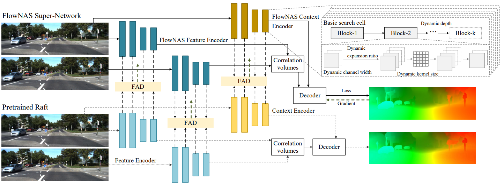

# FlowNAS: Neural Architecture Search for Optical Flow Estimation

## Introduction

Existing optical flow estimators usually employ the network architectures typically designed for image classification as the encoder to extract per-pixel features. However, due to the natural difference between the tasks, the architectures designed for image classification may be sub-optimal for flow estimation. To address this issue, we propose a neural architecture search method named FlowNAS to automatically find the better encoder architecture for flow estimation task. We first design a suitable search space including various convolutional operators and construct a weight-sharing super-network for efficiently evaluating the candidate architectures. Then, for better training the super-network, we propose Feature Alignment Distillation, which utilizes a well-trained flow estimator to guide the training of super-network. Finally, a resource-constrained evolutionary algorithm is exploited to find an optimal architecture (i.e., sub-network). Experimental results show that the discovered architecture with the weights inherited from the super-network achieves 4.67% F1-all error on KITTI, an 8.4% reduction of RAFT baseline, surpassing state-of-the-art handcrafted models GMA and AGFlow, while reducing the model complexity and latency.



## Environments

Please follow the [official](https://pytorch.org/) to install torch and torchvision

Other requirements:

```
matplotlib tensorboard scipy opencv-python tqdm imageio einops
```

## Data  Preparation

Please follow [RAFT](https://github.com/princeton-vl/RAFT) to download and prepare the dataset.

The final dataset folder will be like:

```
├── datasets
    ├── Sintel
        ├── test
        ├── training
    ├── KITTI
        ├── testing
        ├── training
        ├── devkit
    ├── FlyingChairs_release
        ├── data
    ├── FlyingThings3D
        ├── frames_cleanpass
        ├── frames_finalpass
        ├── optical_flow
```

## Evaluation

You can evaluate a trained model using `evaluate_supernet.py`

```bash
python evaluate_supernet.py --model <model_path> --dataset <sintel or kitti>
```

## Main Results:

|  Architecture  | Sintel clean | Sintel final | KITTI |                           Weights                            |
| :------------: | :----------: | :----------: | :---: | :----------------------------------------------------------: |
|      RAFT      |     1.94     |     3.18     | 5.10  |                              ——                              |
| FlowNAS-RAFT-S |     1.93     |     3.38     |  ——   | [Google_drive](https://drive.google.com/file/d/1IKrIXuRMMU4DkeXjm_N6vfWf7Gehyuww/view?usp=sharing) |
| FlowNAS-RAFT-K |      ——      |      ——      | 4.67  | [Google_drive](https://drive.google.com/file/d/17xUWG8HzfNnxdEYkEQ6TMo2ZtTJoZC_L/view?usp=sharing) |

## TODO

* SuperNet training code
* Searching code

## Acknowledgements

The overall code is based on [RAFT](https://github.com/princeton-vl/RAFT) and [AttentiveNAS](https://github.com/facebookresearch/AttentiveNAS). We sincerely thank the authors for open sourcing their methods.


## Citation

If FlowNAS is useful or relevant to your research, please cite our paper:

```bibtex
@article{lin2022flownas,
  title={FlowNAS: Neural Architecture Search for Optical Flow Estimation},
  author={Zhiwei Lin, Tingting Liang, Taihong Xiao, Yongtao Wang, Zhi Tang, Ming-Hsuan Yang},
  journal={arXiv preprint arXiv:2207.01271},
  year={2022}
}
```